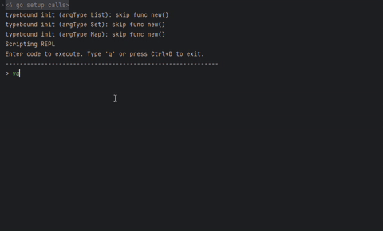

# Rice


**Rice** is a minimal embeddable scripting language for Go applications.

- Dynamic-typing
- Functional programming support
- Lightweight standard library
- Single-threaded execution
- Built-in profiler
- Verbose error-reporting

> ⚠️ Rice is under development and subject to changes without prior notice; there is currently no backward compatibility. Try at your own risk.

## Playground

Try Rice directly in your browser: https://rice-playground.vercel.app/

## LLM prompt
An official LLM prompt is available to be attached to LLM conversations. It provides full syntax and standard library guide to the LLM models. Battle-tested on Claude, Gemini, GPT, DeepSeek, MiMo models.

Download here [llm-prompt.md](./llm-prompt.md)

## Install

```bash
go get github.com/anhcraft/rice
```

## Quick Start

```go
package main

import (
	"context"
	"fmt"
	"os"

	"github.com/anhcraft/rice/exec"
	"github.com/anhcraft/rice/exec/conf"
	"github.com/anhcraft/rice/frontend"
)

func main() {
	script := `
    var greet = func (name) {
        return "Hello, " + name + "!"
    };
		greet("Rice");
	`

	// 1. Tokenize
	tokens, err := frontend.Tokenize(script)
	if err != nil {
		panic(err)
	}

	// 2. Parse
	parser := frontend.NewParser(tokens)
	ast := parser.Parse()
	if len(parser.Errors()) > 0 {
		panic(parser.Errors()[0])
	}

	// 3. Interpret
	it := exec.NewInterpreter(conf.NewDefaultEnvConfig())
	result, err := it.Interpret(context.Background(), ast, conf.NewDefaultRunConfig())
	if err != nil {
		panic(err)
	}

	fmt.Println(result) // "Hello, Rice!"
}
```

> See [examples/example.go](examples/example.go) for a more advanced usage including error tracing and profiling.

## Language Tour

### 1. Data types
```
list.new().append(
    # Primitives
    123,         # integer
    123.456,     # float
    true,        # bool
    "Xin chao!", # string
    null,        # null
    
    # Composites
    list.new(),  # list
    set.new(),   # set
    map.new(),   # map
    func() {     # function
       return
    }
)
```

### 2. Functional programming
```
strings.join("\n", ...map.new()
    .put(
        "Fruit 1", "Apple",
        "Fruit 2", "Banana",
        "Fruit 3", "Cherry",
        "Fruit 4", "Durian",
        "Fruit 5", "Elderberry"
    )
    .filter(func(entry){
        typeof(entry[1]) == "String" && entry[1].toLower().include("a")
    })
    .entries()
    .sort(func(a,b){a[1]<b[1]})
    .map(func(entry){entry[0]+": "+entry[1]}))
```

### 3. First-class expression
```
const yes = if typeof(true) == "Bool" {
    const res = "Yes";

    res # The last expression is the code-block's value
} else {
    "No"
};
```

> See full language tutorial as code at [tutorial.rice](./examples/tutorial.rice) or via the official LLM prompt [llm-prompt.md](./llm-prompt.md)

## Tools
### 1. Error stacktrace
```
RuntimeError:
└─Caused at <root> (at 0:0-0:0)
 ↑ cannot eval script statement #10 (at 97:2111-97:2166)
 └─Caused at CallExpr (at 97:2111-97:2166)
  ↑ cannot eval block statement #4 (at 89:1910-89:1931)
  ↑ cannot eval declaration value (at 89:1920-89:1931)
  └─Caused at CallExpr (at 89:1920-89:1931)
   ↑ cannot eval block statement #1 (at 54:1189-58:1344)
   ↑ iteration gets interrupted (at 54:1189-58:1344)
   ↑ cannot eval block statement #1 (at 56:1306-57:1334)
   ↑ cannot eval assignment value (at 56:1313-57:1334)
   ↑ cannot eval args[0] (at 56:1320-56:1324)
   ↑ cannot eval index (at 56:1322-56:1323)
   ↑ unresolved reference "j"
```

### 2. Profiling
```
[Root] taken 461.492ms (100.00%) at 0:0
  └─[Call] taken 284.887ms (61.73%) at 106:3869
    └─[Block] taken 284.887ms (100.00%) at 8:371
      └─[ForLoop] taken 284.887ms (100.00%) at 12:458
        └─[Block] (x10000) taken 270.419ms (94.92%) at 12:490
          └─[Call] (x10000) taken 227.73ms (84.21%) at 13:516
            └─[Call] (x10000) taken 219.667ms (96.46%) at 13:516
              └─[Call] (x10000) taken 203.129ms (92.47%) at 13:516
                └─[Call] (x10000) taken 172.021ms (84.69%) at 13:516
                  └─[Call] (x10000) taken 141.024ms (81.98%) at 13:516
                    └─[Call] (x10000) taken 54.31ms (38.51%) at 13:516
                      └─[Call] (x10000) taken 14.978ms (27.58%) at 13:516
                    └─[Call] (x10000) taken 26.054ms (18.48%) at 15:592
                └─[Call] (x10000) taken 24.048ms (11.84%) at 17:699
          └─[Call] (x10000) taken 26.863ms (9.93%) at 21:818
      └─[Call] taken 0s (0.00%) at 9:394
      └─[Call] taken 0s (0.00%) at 10:434
...
```

### 3. REPL/CLI
- The official REPL/CLI allows you to quickly try the language, discover the underlying process of lexing and parsing.



## Benchmarks

Run on Intel® Core™ i3-10105 @ 3.70 GHz, Go 1.24, Windows 11. Benchmarks executed via [`exec/bench_test.go`](exec/bench_test.go) with `go test -bench=. -benchmem`.

| Benchmark | Ops/sec | ns/op | B/op | allocs/op | Description |
|---|---|---|---|---|---|
| Fibonacci(20) | 16 | 60,194,989 | 28 MB | 395,701 | Recursive function call overhead — `fib(20)` |
| ForLoop(10000) | 88 | 11,334,590 | 1.8 MB | 149,627 | Tight C-style for-loop, 0..9999 sum |
| Arithmetic(5000) | 140 | 7,166,243 | 1.3 MB | 117,771 | Integer arithmetic in a loop (add/mul/div) |
| RecursionDeep(15) | 137 | 7,292,346 | 2.5 MB | 34,993 | Moderately deep recursion — `fib(15)` |
| StringConcat(1000) | 832 | 1,202,009 | 704 KB | 14,525 | String concatenation loop, 1000 iterations |
| Functional | 14,946 | 66,921 | 18 KB | 312 | List `filter` + `map` on 5-element dataset |

### Single-run Profiler Reports

**Fibonacci(20)** — deep recursion tree:
```
[Root] taken 76.172ms (100.00%) at 0:0
  └─[Call] taken 76.172ms (100.00%) at 8:107
    └─[Block] taken 76.172ms (100.00%) at 2:24
      └─[Call] taken 47.03ms (61.74%) at 6:73
        └─[Block] taken 47.03ms (100.00%) at 2:24
          └─[Call] taken 27.709ms (58.92%) at 6:73
            └─[Block] taken 27.709ms (100.00%) at 2:24
              └─[Call] taken 18.201ms (65.69%) at 6:73
                └─[Block] taken 18.201ms (100.00%) at 2:24
                  └─[Call] taken 9.814ms (53.92%) at 6:73
                    └─[Block] taken 9.814ms (100.00%) at 2:24
                      └─[Call] taken 7.063ms (71.97%) at 6:73
                        └─[Block] taken 7.063ms (100.00%) at 2:24
                          ...
```

**ForLoop(10000)** — dominated by the loop body:
```
[Root] taken 26.943ms (100.00%) at 0:0
  └─[ForLoop] taken 26.943ms (100.00%) at 3:20
    └─[Block] (x10000) taken 17.625ms (65.41%) at 3:52
```

**Functional** — list higher-order functions on 5 elements:
```
[Root] taken 1.01ms (100.00%) at 0:0
  └─[Call] taken 1.01ms (100.00%) at 9:270
    └─[Block] (x5) taken 0s (0.00%) at 9:302
```

**Arithmetic(5000)** — arithmetic in a tight loop:
```
[Root] taken 27.948ms (100.00%) at 0:0
  └─[ForLoop] taken 27.948ms (100.00%) at 3:18
    └─[Block] (x5000) taken 23.969ms (85.76%) at 3:49
```

**StringConcat(1000)** — string concatenation in a loop:
```
[Root] taken 2.822ms (100.00%) at 0:0
  └─[ForLoop] taken 2.822ms (100.00%) at 3:19
    └─[Block] (x1000) taken 2.029ms (71.90%) at 3:50
```

## FAQ
1. What is the file extension of Rice script? Simply, `.rice`
2. Does Rice support resource constraints? Time-bound limit is supported per user-defined function, native function and the overall script (via Go context)
3. What kind of interpreting Rice performs? Currently, it features an AST tree-walking interpreter, and eventually switch to bytecode interpreter in near future
4. How can I extend Rice with custom Go functions? Rice is designed to be highly extensible. You can expose your own Go functions and types to the environment

## Roadmap

| Features    | Stage |
|-------------|-------|
| Base        | ✅     |
| REPL/CLI    | ✅     |
| Profiler    | ✅     |
| Bytecode VM | ❌     |
| LSP         | ❌     |
| Playground  | ✅     |
